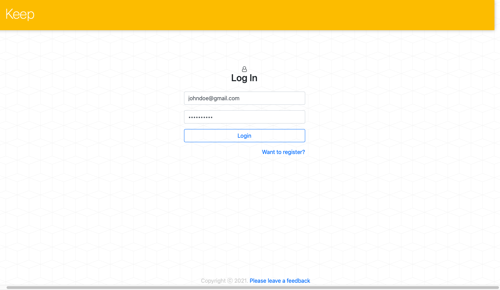
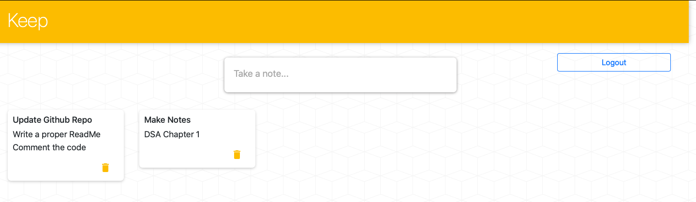

# Google Keep Clone - Front End - React

* Deployed at : https://infinite-brushlands-70873.herokuapp.com
* Google Keep Clone Server - https://github.com/rathiraghav00/Google-Keep-Clone-Server
* Clone of Google Keep to Create, Read and Delete Notes 
* Frontend supported by React, HTML, CSS, Bootstrap and Javascript
* Backend supported by Express.js, MongoDB, Mongoose, Postman and REST API

  Screenshot of Login Page

  Screenshot of Keep Page, storing all the notes

